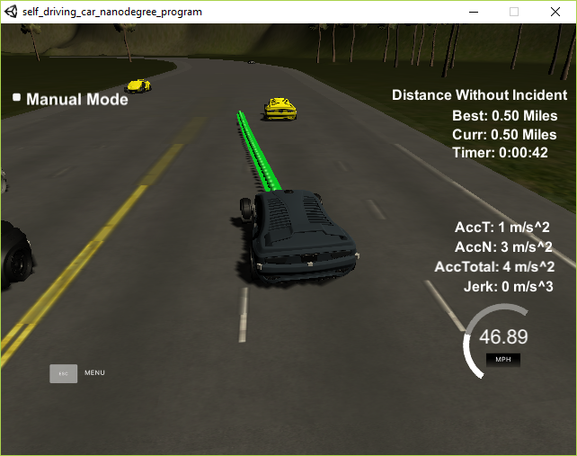
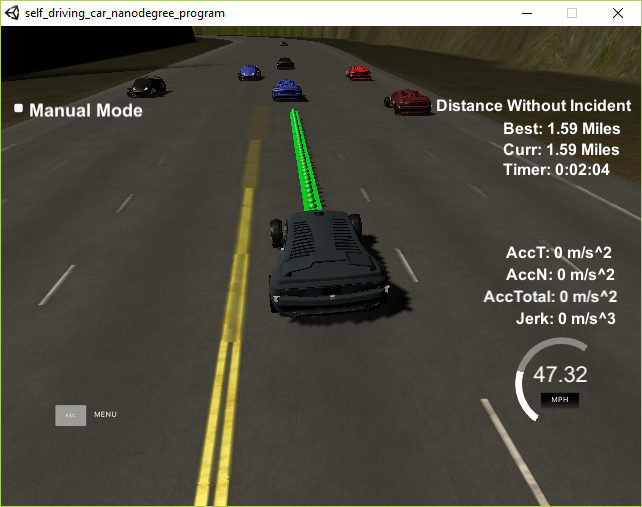

# CarND-Path-Planning-Project
Self-Driving Car Engineer Nanodegree Program
   
### Simulator.
You can download the Term3 Simulator which contains the Path Planning Project from the [releases tab (https://github.com/udacity/self-driving-car-sim/releases).

### Goals
In this project your goal is to safely navigate around a virtual highway with other traffic that is driving +-10 MPH of the 50 MPH speed limit. You will be provided the car's localization and sensor fusion data, there is also a sparse map list of waypoints around the highway. The car should try to go as close as possible to the 50 MPH speed limit, which means passing slower traffic when possible, note that other cars will try to change lanes too. The car should avoid hitting other cars at all cost as well as driving inside of the marked road lanes at all times, unless going from one lane to another. The car should be able to make one complete loop around the 6946m highway. Since the car is trying to go 50 MPH, it should take a little over 5 minutes to complete 1 loop. Also the car should not experience total acceleration over 10 m/s^2 and jerk that is greater than 10 m/s^3.

#### The map of the highway is in data/highway_map.txt
Each waypoint in the list contains  [x,y,s,dx,dy] values. x and y are the waypoint's map coordinate position, the s value is the distance along the road to get to that waypoint in meters, the dx and dy values define the unit normal vector pointing outward of the highway loop.

Each waypoint in the list contains ```[x, y, s, dx, dy]``` values. ```x``` and ```y``` are the waypoint's map coordinate position, the ```s``` value is the distance along the road to get to that waypoint in meters, the ```dx``` and ```dy``` values define the unit normal vector pointing outward of the highway loop.

The track contains a total of 181 waypoints, with the last waypoint mapping back around to the first. The waypoints are located in the middle of the double-yellow diving line.

The highway's waypoints loop around so the frenet ```s``` value, distance along the road, goes from 0 to 6945.554.

The track is 6945.554 meters around (about 4.32 miles). Thedistance along the road, goes from 0 to 6945.554 in frenet s coordinates.

# My Approach 

In general there are a lot fo possible approaches to solve this problem. In this approach I try to keep things as easy as possible and to be able to drive one lap without accident and matching all project requirements. [Project requirements in detail.](https://review.udacity.com/#!/rubrics/1020/view)

First step is to drive safe in one the current ego lane and be able to follow a car in a certain distance. Further more the ego vehicle needs to be able to react on sudden decellerations of the leading car. We distinguish between four szenarios for calculating the target longitudinal acceleration for lane driving. Below the neccessary calculations for each case.

1. No car is in front of us --> Also called set speed control
``` cpp
axEgo = (setSpeed - car_speed) / tauGapSetSpeed;
```       
2. Leading car available but faster as ego --> also called follow control
``` cpp
    tEgo = 1.25;
    axEgo = (closestObject.speed - car_speed) / tEgo;
```
3. Leading car available but slower than as ego --> also called follow control
``` cpp
    tEgo = 2.0F * desiredDistance / (car_speed - closestObject.speed);
    axEgo = (closestObject.speed - car_speed) / tEgo;
```
4. Leading car decellerate a lot --> also called approach control
``` cpp
if (closestObject.distanceToEgo <= double(6.0)) {
    axEgo = -4.0; // m/s2
    axEgo = limitAcceleration(axEgo, axLimitPositiv, axLimitNegativ);
```
To avoid unnatural accelerations the calculated axEgo value is limited by defined parameter. This enables to match the requirements for longitudinal acceleration value.
```cpp
  if (axEgo > axLimitPositiv) {
    axEgo = axLimitPositiv;
  } else if (axEgo < axLimitNegativ) {
    axEgo = axLimitNegativ;
  }
```
To be able to calculate the equations above I search for the closest vehicle in target lane. Further more we react as recently as the closest object is within a range of x meters. This is a parameter and I set it to frenet s = 20. For the lane driving equations exist a lot of parameter to apllicate. The values depend on what performance one want to achieve.
Hint: The target lane is not everytime the ego lane. In case the system decides to change the lane, the target lane will be the new desired lane and in case there is a leading vehicle the system will react on this one in longitudinal direction to avoid crashes.

### A little little state machine
The second stepis to evaluate what is best behavior in current traffic scenario. Based on the evaluation of the ego state according to ego speed ego lane etc. In combination with the state of all relevant vehicles in the lanes arround ego, the system builds up a decision about which lane is the best for the current cycle.

In general there are three possibilities to check depending ont the current ego lane:
| **Lane 0** | **Lane 1**| **Lane 2**|
| ---------- |:---------:| ---------:|
| turn right | turn left | turn left |
| keep lane  | keep lane | keep lane |
| ---------  | turn right| --------- |

### A simple cost algorithm
Every time we have a leading vehicle in front which is slower then max speed and and witin a parametrizeable distance we calculate the following cost for each possible lane.

For getting a sense whether the possible new lane is a good choice we calculate the average speed of all vehicles in this lane in a meaningful distance to ego.

1. Evaluate Lane Cost: In general a lane change is not the best possibility and depending on this passive strategy we give a lane change a cost of 1000. Furthermore the system penalize a lane change to lane 2 by factor 3 because here we have usually lower average speeds and it could be possible for the car to get on speed again because the car would be surrounded by other vehicle which make it impossible to change to a faster lane
```cpp
if (laneCases[1] == 2 && lane == 1) {
      cost += 3000;
    } else if (laneCase != lane) {
      cost += 1000;
    }
```
2. Evaluate Speed Cost: The higher the average speed of the target lane - the lower the cost
```cpp
double getNormalized(double x) { return 2.0f / (1.0f + exp(-x)) - 1.0f; }
cost += getNormalized(2.0 * (avgSpeed - car_speed / avgSpeed)) * 1000;
```
- So in case 
3. Evaluate Collision cost when new closest vehicle is in a distance smaller thana parametrizeable gap cost 
```cpp
  closestObject = getClosestDistanceOfEnteredCarIdsPerLaneInFront(
  cars_ids, sensor_fusion, 0.02 * prev_size, car_s);
  if (closestObject < gap) {
      cost += 100000; }
```

at the end the lane with the best cost wins and will be entered for calculate the new waypoints.

### Calculate Trajectory

For calculate a comfortable trajectory and fit all requirements for longitudinal and lateral limitation of acceleration and jerks I use the spline libary:
A really helpful resource for doing this project and creating smooth trajectories was using http://kluge.in-chemnitz.de/opensource/spline/, the spline function is in a single heather file is really easy to use.

Another approach could be to use jerk minimized trajectory. this are polynomials of 5th order and are well documented in this document [document from Moritz Werling](https://d17h27t6h515a5.cloudfront.net/topher/2017/July/595fd482_werling-optimal-trajectory-generation-for-dynamic-street-scenarios-in-a-frenet-frame/werling-optimal-trajectory-generation-for-dynamic-street-scenarios-in-a-frenet-frame.pdf)

## A example action
### lane change

### lane driving


[video link](./imgAndVideo/2017-12-10_12h15_43.mp4)


# Fazit:

This can be a project for life time. this approach tries to simplyfy the problem within the given constrains to make sure not to over engineer the approach. There are a lot of possible improvements according to performance and decision making. Further more it could be a lot of fun to implement the JMT approach of Moritz Werling. 

## Basic Build Instructions

1. Clone this repo.
2. Make a build directory: `mkdir build && cd build`
3. Compile: `cmake .. && make`
4. Run it: `./path_planning`.

### Simulator
You can download the Term3 Simulator which contains the Path Planning Project from the [releases tab](https://github.com/udacity/self-driving-car-sim/releases).

# Details about the simluation environment

Here is the data provided from the Simulator to the C++ Program

#### Main car's localization Data (No Noise)

["x"] The car's x position in map coordinates

["y"] The car's y position in map coordinates

["s"] The car's s position in frenet coordinates

["d"] The car's d position in frenet coordinates

["yaw"] The car's yaw angle in the map

["speed"] The car's speed in MPH

#### Previous path data given to the Planner

//Note: Return the previous list but with processed points removed, can be a nice tool to show how far along
the path has processed since last time. 

["previous_path_x"] The previous list of x points previously given to the simulator

["previous_path_y"] The previous list of y points previously given to the simulator

#### Previous path's end s and d values 

["end_path_s"] The previous list's last point's frenet s value

["end_path_d"] The previous list's last point's frenet d value

#### Sensor Fusion Data, a list of all other car's attributes on the same side of the road. (No Noise)

["sensor_fusion"] A 2d vector of cars and then that car's [car's unique ID, car's x position in map coordinates, car's y position in map coordinates, car's x velocity in m/s, car's y velocity in m/s, car's s position in frenet coordinates, car's d position in frenet coordinates. 

## Details

1. The car uses a perfect controller and will visit every (x,y) point it recieves in the list every .02 seconds. The units for the (x,y) points are in meters and the spacing of the points determines the speed of the car. The vector going from a point to the next point in the list dictates the angle of the car. Acceleration both in the tangential and normal directions is measured along with the jerk, the rate of change of total Acceleration. The (x,y) point paths that the planner recieves should not have a total acceleration that goes over 10 m/s^2, also the jerk should not go over 50 m/s^3. (NOTE: As this is BETA, these requirements might change. Also currently jerk is over a .02 second interval, it would probably be better to average total acceleration over 1 second and measure jerk from that.

2. There will be some latency between the simulator running and the path planner returning a path, with optimized code usually its not very long maybe just 1-3 time steps. During this delay the simulator will continue using points that it was last given, because of this its a good idea to store the last points you have used so you can have a smooth transition. previous_path_x, and previous_path_y can be helpful for this transition since they show the last points given to the simulator controller with the processed points already removed. You would either return a path that extends this previous path or make sure to create a new path that has a smooth transition with this last path.

## Tips

A really helpful resource for doing this project and creating smooth trajectories was using http://kluge.in-chemnitz.de/opensource/spline/, the spline function is in a single hearder file is really easy to use.

---

## Dependencies

* cmake >= 3.5
 * All OSes: [click here for installation instructions](https://cmake.org/install/)
* make >= 4.1
  * Linux: make is installed by default on most Linux distros
  * Mac: [install Xcode command line tools to get make](https://developer.apple.com/xcode/features/)
  * Windows: [Click here for installation instructions](http://gnuwin32.sourceforge.net/packages/make.htm)
* gcc/g++ >= 5.4
  * Linux: gcc / g++ is installed by default on most Linux distros
  * Mac: same deal as make - [install Xcode command line tools]((https://developer.apple.com/xcode/features/)
  * Windows: recommend using [MinGW](http://www.mingw.org/)
* [uWebSockets](https://github.com/uWebSockets/uWebSockets)
  * Run either `install-mac.sh` or `install-ubuntu.sh`.
  * If you install from source, checkout to commit `e94b6e1`, i.e.
    ```
    git clone https://github.com/uWebSockets/uWebSockets 
    cd uWebSockets
    git checkout e94b6e1
    ```
## Code Style

Please (do your best to) stick to [Google's C++ style guide](https://google.github.io/styleguide/cppguide.html).


